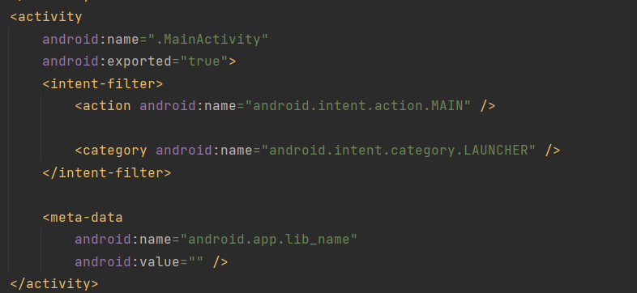
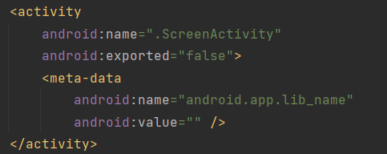

## Memoria projecte LoginApp

### Codi de les activitats:

- Com accedixc als elements de les activitats:

    Per a accedir a les activitats utilitze la funcio findViewById la cual me permet trobar la activitat que necesite utilitzant la seua id i almatzenar-ho com una variable, per exemple per a el nom de usuari utilitze la seguent linea de codic:  
    `val user = findViewById<EditText>(R.id.editTextTextUsername)`

- Com he realitzat la navegacio entre acitivitats:

    Com se demana en la activitat per a cridar a la funcio he utilitzat una variable de tipo Intent, a la cual li pase com a parametres la funció en la que esta i la funcio a la que pasa, seguit utilitze "Intent.putExtra()" per a pasar el usuari donantli com a parametres el valor i la clau, finalment inicie la crida a la activitat indica

### Sobre el fitxer manifest:

- Quantes activitats apareixen configurares? Mostra-les i indica les principals diferències entre elles i què signifiquen.

    Apareixen 2 activitats:
    - La pantalla de Login: 
     
    
     
    - La pantalla de Welcome:    
     
    
     

    La principal diferencia entre ambes es l'existencia de l'etiqueta intent-filter, la cual se encarrega de declar lo que una activitat por fer i que tipus de emisions pot fer el receptor

- Observa l’atribut android:exported en elles i investiga en la documentació d’Android què significa i quines repercusions té el seu valor en l’aplicació.

    Android:exported estableix si un component de altra activitat por iniciar l'actividad, en cas de `True` si que podra en cas de `False` no

### Sobre les traduccions realitzades:

- Examina la carpeta dels recursos de tipus String, tant en la vista d’Android com en la vista dels fitxers del projecte. Hi ha nous fitxers, carpetes o recursos? Quin nom tenen i què contenen cadascun?

    Sí, hi han nous fitxers i cambis:
    - Se ha creat la carpeta "strings"
    - Se ha mogut el fitxer "strings.xml" a la carpeta strings
    - Se ha creat un arxiu per a cada escun del idiomes amb el nom format per el codi del idioma \ el nom original